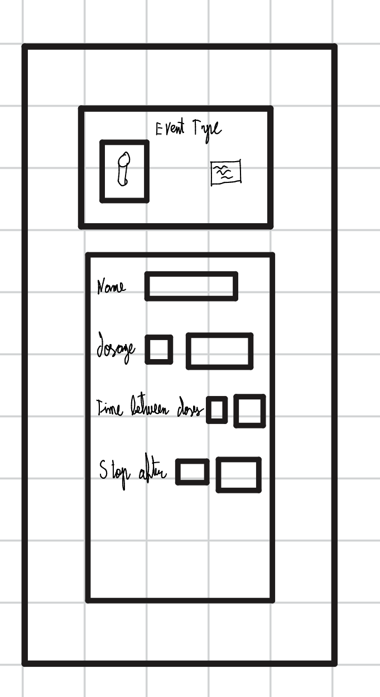
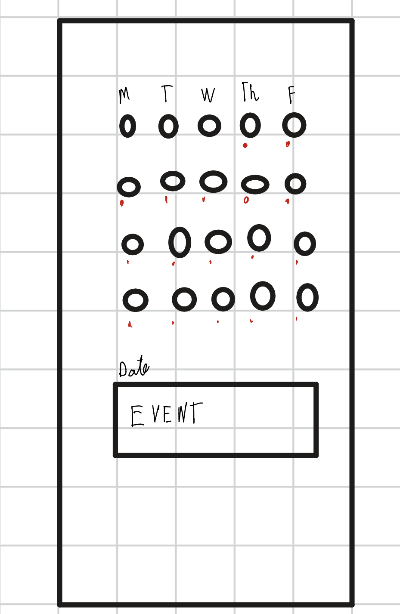
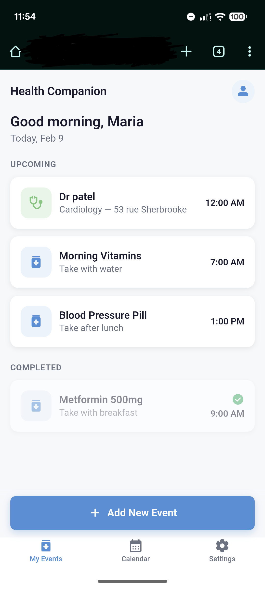
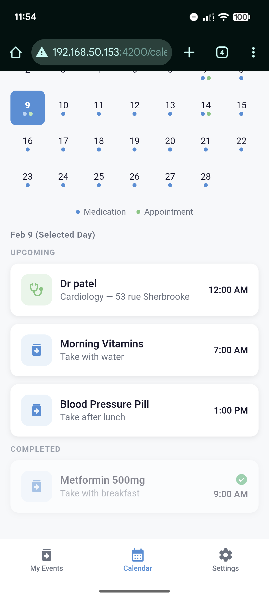
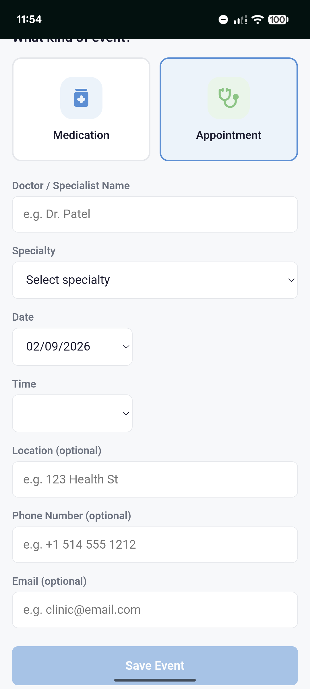
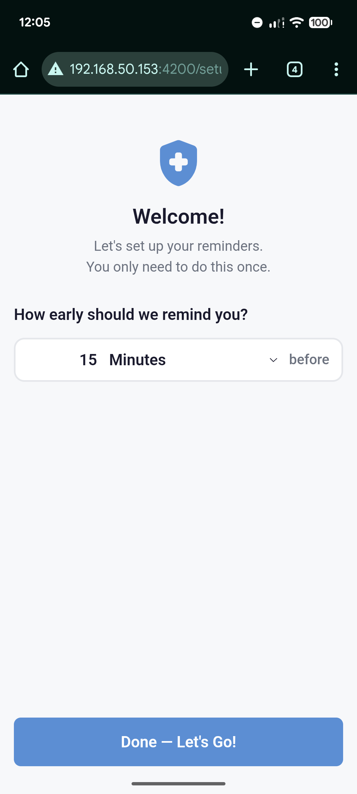

# Health Companion Super App
## UX/UI Case Study

**Author:** Sergio Abreo Alvarez ID:40274677
**Date:** February 2025
**Page URL:** https://pergioa.github.io/

## Project Overview

A mobile app designed to help individuals manage their intake of medications or to set reminders for their medical appointments. The app is also meant to help users find all related information about their medications and medical appointments in one place through their respective events.

### Problem Statement

People with chronic conditions often juggle medications, appointments, and doctor communication while trying to live their everyday lives. Forgetfulness, disorganization, and poor coordination can negatively affect their health outcomes.

Our challenge is to design an intuitive mobile app that simplifies health management, improves adherence, and helps users feel in control of their care.

### Goals

- Help users manage medication schedules effectively
- Simplify doctor appointment booking and reminders
- Enable communication with healthcare providers
- Track health progress over time

## 1. User Research

### Research Methods

For this project and article, I conducted a series of interviews with persons that are in the age range of 30 to 60 years old in order to get a wider view on what an application of this nature should be.

For privacy reasons, and because the people that were interviewed asked to remain anonymous, I will discuss their opinions and needs as a group and refer to them as "They" in this section of the article.

#### Interviews
The way that the interviews were handled, I, the "researcher" for this project and product, asked a set of simple questions when it comes to the user interface of the application and the user interactions.

My main questions were the following:

1. How should reminders be set, per event, depending on the nature of the event, or should it be a global setting for all events?
2. How should the events be created? 
3. How many details should the user be required to fill in?
4. What details should be required for each event type?
5. Should the app have extensive setting customization? Or should it use the accessibility settings taken from the device?
6. What accessibility accommodations would they like to see in the application?

Across the board, participants had a consistent set of answers for each question.

The needs and wants that I could take away from my interviews are the following:

1. Reminders should all have the same behavior and should be set globally and only once.
2. Events should be created through the main page, which would then take the user to another page that is dedicated to the event creation.
3. The user should have a visual selector for the medication or appointment selection field. Depending on which event type the user selects, the following input fields will be displayed accordingly.
4. The required details are only the essentials related to each kind of event.
5. The app should require very little to no setup.
6. The users want the input fields to be easy to understand and to fill up.

#### Secondary Research
In order to get a better picture of the utility and need for an application of this nature, I also took the liberty to look up existing studies related to the impacts of health companion applications for individuals that need to take medications on a regular basis.

From what I found based on the following articles:

1. Iribarren S, Akande T, Kamp K, Barry D, Kader Y, Suelzer E
Effectiveness of Mobile Apps to Promote Health and Manage Disease: Systematic Review and Meta-analysis of Randomized Controlled Trials
JMIR Mhealth Uhealth 2021;9(1):e21563
URL: https://mhealth.jmir.org/2021/1/e21563
DOI: 10.2196/21563

2. Yihang Peng, MN, Han Wang, MM, Qin Fang, BS 949560838@qq.com, Liling Xie, BS, Lingzhi Shu, MN, Wenjing Sun, MN, and Qin Liu,
Effectiveness of Mobile Applications on Medication Adherence in Adults with Chronic Diseases: A Systematic Review and Meta-Analysis
Journal of Managed Care & Specialty Pharmacy Volume 26, Number 4
URL: https://www.jmcp.org/doi/10.18553/jmcp.2020.26.4.550
DOI: 10.18553/jmcp.2020.26.4.550

Both of those articles explore the benefits of having a companion app to set reminders for medication. While they both express in their own way the need for further research, they did conclude that there is credible evidence that the use of a companion app such as the one for this mini-project has a meaningful impact on a user's ability to adhere to their medication in the long term.

Through the research that I conducted regarding existing articles on this matter, I did come across a few more that for the needs of this article would not necessarily add more relevant information than the above-mentioned ones. However, I did see a recurring theme where they asked the same question multiple times. What are the features of a companion app that make it so users take their medication regularly at the right time? They would also ask a follow-up question along the lines of, what new features could be added to the optimal health companion app?

### Key Research Findings

Following the interviews and secondary research, I have the following key findings that dictate the design of the application:

| Finding | Insight | Design Implication |
|---------|---------|-------------------|
| Global setting for reminders | This is done once at the first use and never changes unless the user wants to | Event creation page has one less field, main feature of the app is automated |
| Dedicated page for event creation | Users want a robust mechanism to add event details| Extra page for the application |
| Key UI elements should be images | UI should be simplified to accommodate users with lower cognitive capabilities | Make use of skeuomorphism |
| No dedicated page for event type | Users want to have all relevant information on the same page | No need for dedicated pages for each event type |

## 2. User Personas

PLACE HOLDER TO TEST LAYOUT OF THE PAGE

### Persona 1: Maria Santos

| Attribute | Details |
|-----------|---------|
| **Age** | 54 |
| **Occupation** | Elementary School Teacher |
| **Health Condition** | Type 2 Diabetes and Hypertension |
| **Tech Comfort** | Low to Moderate: uses her phone mainly for calls, messaging, and basic apps |

**Goals:**
- Keep track of her daily medications (metformin, blood pressure pills) without having to memorize times or doses
- Have a single place to see upcoming doctor appointments so she never misses a check-up
- Spend as little time as possible setting up the app so she can focus on her day

**Motivations:**
- After missing a dose of her blood pressure medication and experiencing dizziness at work, Maria wants a reliable system that keeps her on track
- She values simplicity, she does not want to learn a complicated app; she wants something that "just works" after a quick setup

**Pain Points:**
- She currently relies on handwritten notes and memory to manage her medications, which leads to missed doses especially during busy school days
- Coordinating appointments across multiple specialists (endocrinologist, cardiologist, family doctor) is confusing and she has double-booked in the past
- Apps she has tried before required too much setup and had cluttered interfaces that overwhelmed her

**Quote:** *"I just want something simple that reminds me to take my pills and tells me when my next appointment is, I don't need all the bells and whistles."*

### Persona 2: David Chen

| Attribute | Details |
|-----------|---------|
| **Age** | 37 |
| **Occupation** | Software Project Manager |
| **Health Condition** | Asthma and Generalized Anxiety Disorder |
| **Tech Comfort** | High: comfortable with technology and uses multiple productivity apps daily |

### Persona 3: Chris Redfield

| Attribute | Details |
|-----------|---------|
| **Age** | 70 |
| **Occupation** | Retired |
| **Health Condition** | Depression |
| **Tech Comfort** | Low: has a basic understanding of how to use a phone |

**Goals:**
- Manage his daily depression medication
- Keep up with his treatment to get better
- Have an easy-to-understand application

**Motivations:**
- Since his wife died a few months back, Chris has been dealing with depression and struggled to take his medications on a regular basis
- He wants to have a reminder that is hard to miss for his medications and routine appointments with the psychologist

**Pain Points:**
- Due to his depression, he has very little motivation to do anything, which makes it easy for him to not take his depression medication
- He finds technology hard to use and understand without the help of a younger individual, an intuitive design would allow him to use the application
- He wants to have systematic reminders for all important events related to his medication and appointments in order to overcome his depression

**Quote:** *"Since my wife died, I have struggled with depression. It has been difficult for me to keep up with my medication since most days I don't feel like doing anything and want to stay in bed."*

## 3. User Journey Map

### Journey Stages

#### Stage 1: Awareness
- **Actions:** The user learns about the app through a doctor's recommendation, a family member's suggestion, or an app store search after missing a dose or forgetting an appointment
- **Thoughts:** "I need something to help me stay on top of my medications and appointments, but will this app be easy enough for me to use?"
- **Emotions:** Frustrated with current methods of tracking health tasks, but hopeful that a solution exists
- **Pain Points:** Users like Maria rely on handwritten notes that get lost, David feels overwhelmed juggling multiple productivity tools, and Chris lacks the motivation and tech skills to search for a solution on his own
- **Opportunities:** Clear and simple app store descriptions, accessibility-focused marketing, and a reassuring first impression that signals ease of use

#### Stage 2: Onboarding
- **Actions:** The user downloads the app, opens it for the first time, and is guided through a minimal setup process where they configure their global reminder preferences
- **Thoughts:** "This setup is quick, I only need to set my reminder preferences once and I am ready to go"
- **Emotions:** Relieved that the setup requires very little effort, cautiously optimistic about using the app going forward
- **Pain Points:** Users with low tech comfort like Maria and Chris may hesitate at any screen that feels unfamiliar or asks for too much information upfront, while David may want to ensure the app integrates well with his existing routine
- **Opportunities:** A one-screen onboarding flow with clear visual cues, large input fields, and a brief walkthrough that builds confidence without overwhelming the user

#### Stage 3: Daily Use
- **Actions:** The user receives a reminder notification, opens the app, confirms they took their medication, and occasionally checks upcoming appointments on the main screen
- **Thoughts:** "The reminder went off right on time, let me mark my medication as taken so I can move on with my day"
- **Emotions:** Confident and in control of their health routine, with a sense of accomplishment after confirming each dose
- **Pain Points:** Chris may still struggle with motivation on difficult days and could dismiss a notification without acting on it, Maria may find it hard to respond during busy school hours, and David may need the reminder to cut through the noise of his many other app notifications
- **Opportunities:** Persistent or escalating reminders that are hard to miss, a simple one-tap confirmation to mark a dose as taken, and a clear visual summary on the main screen that reinforces progress

#### Stage 4: Appointment Booking
- **Actions:** The user navigates to the event creation page from the main screen, selects the appointment event type, fills in the essential details using visual selectors, and saves the event
- **Thoughts:** "I can see all my upcoming appointments in one place now, no more double-booking or forgetting which specialist I am seeing next"
- **Emotions:** Organized and reassured that their appointments are tracked, less anxious about managing multiple healthcare providers
- **Pain Points:** Maria has double-booked specialists in the past due to poor coordination, Chris needs the input fields to be straightforward and visually guided so he can complete them independently, and David wants the process to be efficient and not require redundant data entry
- **Opportunities:** Visual selectors and skeuomorphic elements that simplify the input process, automatic conflict detection to prevent double-booking, and a unified calendar view that displays both medication and appointment events together

## 4. Wireframes

### Low-Fidelity Wireframes

#### Home Screen

*Description: On this page the user can see all their events for the day, go to settings, or make a new event*

#### Appointment Scheduling Screen

*Description: On this page the user can make a new event for an appointment*

#### Medication Scheduling Screen

*Description: On this page the user can make a new event for a medication*

#### Additional Screens

*Description: On this page the user can view events based on a given date. This was added based on feedback that will be talked about more in depth in a later section*

*What changed and why:* Additionally, a few more changes were done in order to make the app easier to use for all kinds of users. The specifics will be talked about in depth in a later section.

The main changes are related to the size and styling of buttons and animations for dynamic elements.

## 5. Prototype

### Interactive Prototype

#### Iteration 1 home page

*Description: On this iteration we could not see a difference between events that had been completed or not*

#### Iteration 2 home page

*Description: This version groups the events into 2 sections, completed and not completed. The completed events also have a different styling to further set them apart*

#### Iteration 1 Calendar view

*Description: On this iteration we could not see a difference between events that had been completed or not like in the home page iteration 1*

#### Iteration 2 Calendar view

*Description: This version groups the events into 2 sections, completed and not completed. The completed events also have a different styling to further set them apart*

#### Create medicament event

*Description: This page saw small key changes over the course of this case study. Animations were added for the dynamic elements and the create button had its styling updated*

#### Create appointment event

*Description: This page saw small key changes over the course of this case study. Animations were added for the dynamic elements and the create button had its styling updated*

#### Settings page

*Description: This page saw no changes over the course of this case study*

#### First usage page

*Description: This page saw no changes over the course of this case study*

**Angular prototype repo link:** 

- [Repo to interactive prototype](https://github.com/pergioa/UI-MockUp-SOEN357)

### User Flow

The prototype demonstrates two primary user flows that represent the core functionality of the application: creating a medication event and responding to a reminder.

**Flow 1: First-Time Setup and Medication Event Creation**

1. User opens the app for the first time and is presented with the onboarding screen
2. User sets their global reminder preference (e.g., 15 minutes before each event) and confirms
3. User lands on the home screen, which displays a sample event list and a prominent "Create Event" button
4. User taps "Create Event" and is taken to the event creation page
5. User selects the medication event type using the visual selector (pill icon)
6. The conditional input fields for medication appear: medication name, dosage, frequency, and start date
7. User fills in the required fields and taps "Save"
8. User is returned to the home screen where the new medication event now appears in the event list

**Flow 2: Responding to a Medication Reminder**

1. User receives an alert at the scheduled reminder time
2. User taps the alert to acknowledge it, then taps on the current event
3. A large high-contrast "Mark as Taken" button is displayed prominently at the center of the screen
4. User taps the button to confirm the medication was taken
5. The app records the confirmation. The user then manually goes back to the main menu using the "back arrow" button

**Flow 3: Appointment Event Creation**

1. User taps "Create Event" from the home screen
2. User selects the appointment event type using the visual selector (calendar icon)
3. The conditional input fields for appointments appear: doctor name, specialty, date, time, and location
4. User fills in the required fields and taps "Save"
5. User is returned to the home screen where both medication and appointment events are now visible in a unified list

## 6. Usability Testing

### Testing Plan

**Goals:**
- Evaluate whether users can complete core tasks (creating medication events, scheduling appointments, and confirming reminders) without assistance
- Assess if the onboarding flow and global reminder setup are intuitive enough for users with low tech comfort
- Identify pain points in the event creation process, particularly around the visual selectors and conditional input fields

**Participants:** 5 participants were recruited for the usability test. The group was composed of individuals that match the demographics and tech comfort levels represented by the three personas: two participants in the 50-60 age range with low to moderate tech comfort, one participant in the 30-40 age range with high tech comfort, and two participants aged 65 and older with low tech comfort. None of the participants had prior experience with the prototype.

**Tasks:**
1. Complete the onboarding process and set a global reminder preference
2. Create a new medication event for a daily blood pressure pill at 8:00 AM
3. Create a new appointment event with a cardiologist for next Tuesday at 10:00 AM
4. Open the app after receiving a reminder notification and confirm the medication as taken
5. View all upcoming events on the main screen and identify the next scheduled appointment

**Metrics:**
- Task completion rate
- Time on task
- Error rate
- User satisfaction (SUS score)

### Feedback Collection Method

Feedback was collected using a think-aloud protocol where participants were asked to verbalize their thoughts as they navigated the prototype. Each session lasted approximately 20 minutes. After completing all tasks, participants filled out a short post-task questionnaire based on the System Usability Scale (SUS) and were asked three open-ended questions about their overall experience, what they found most intuitive, and what they found most confusing. I took notes during each session and recorded key observations related to hesitation points, errors, and moments of satisfaction.

### Key Findings & Iterations

| Issue Found | Severity | Solution Implemented |
|-------------|----------|---------------------|
| Older participants did not immediately recognize the event type selector as tappable | High | Increased the size of the visual selector icons and added a subtle border highlight to indicate interactivity |
| One participant was confused by the conditional fields that appear after selecting an event type | Medium | Added a short animation when the fields appear and a label that reads "Fill in the details for your [event type]" to provide context |
| Participants with low tech comfort took significantly longer on the appointment creation task | Low | Simplified the required information needed to create the event |
| The confirmation action after a reminder notification was not prominent enough | High | Enlarged the "Mark as Taken" button and changed its color to a high-contrast blue so it stands out immediately upon opening the app |
| There was no way to see events for following days | Medium | Implemented a calendar view to see events on any given day |

### User Feedback Summary

> *"Once I set it up, I did not have to think about it again. The reminder just showed up and I tapped the big blue button. That is exactly what I need."* - Participant 3 (age 58, low-moderate tech comfort)

> *"I like that I do not have to go through a different screen for medications and appointments. Everything is right there on one page when I create an event."* - Participant 1 (age 35, high tech comfort)

> *"At first I was not sure where to tap to pick the medication, but once I saw the pictures it made sense. The pictures help a lot."* - Participant 5 (age 68, low tech comfort)

## 7. Reflection

### What I Learned

This project reinforced how important it is to design with real users in mind rather than relying on assumptions. The interviews and persona development revealed that simplicity is not just a preference but a necessity for users like Maria and Chris, who would abandon an app the moment it feels overwhelming. I learned that a single design decision, such as making reminders a global one-time setting instead of a per-event configuration, can drastically reduce the cognitive load on the user and make the difference between an app that gets used daily and one that gets uninstalled after the first session.

The usability testing phase was particularly eye-opening. Watching participants interact with the prototype in real time exposed issues that I would not have caught on my own, such as the event type selector not looking tappable to older users. This experience taught me that no amount of internal review can replace observing actual users as they navigate a design. The think-aloud protocol gave me direct access to user thought processes and helped me understand not just what was going wrong but why.

I also gained a deeper appreciation for secondary research. The academic articles I reviewed confirmed that companion apps do have a measurable impact on medication adherence, which validated the purpose of this project and gave me confidence that the problem I was solving is both real and meaningful.

### Challenges Encountered

1. **Designing for a wide range of tech comfort levels:** The personas ranged from David, who is highly comfortable with technology, to Chris, who can barely navigate a phone. Balancing the needs of both without making the app feel too basic for one group or too complex for the other was difficult. I overcame this by focusing on visual selectors and skeuomorphic elements that are intuitive for low-tech users while keeping the overall flow efficient enough that tech-savvy users do not feel slowed down.

2. **Keeping the event creation flow on a single page:** The research findings indicated that users did not want separate pages for different event types, but fitting medication and appointment fields on the same page without clutter was a challenge. I addressed this by using conditional fields that only appear after the user selects an event type, keeping the page clean while still consolidating everything in one place.

3. **Making reminders hard to miss without being intrusive:** Chris's persona highlighted that on low-motivation days, a notification can easily be dismissed and forgotten. At the same time, overly aggressive reminders could frustrate users like David who are already managing many notifications. I resolved this by designing a prominent one-tap confirmation button that appears when the event is opened in order to get the full details.

### What I Would Do Differently

If I were to start this project over, I would recruit a larger and more diverse group of participants for both the initial interviews and the usability testing. Five participants provided valuable insights, but a larger sample would have increased confidence in the findings and potentially revealed edge cases that were missed. I would also conduct a second round of usability testing after implementing the changes from the first round to verify that the solutions actually resolved the identified issues rather than introducing new ones.

Additionally, I would explore accessibility features more thoroughly from the start. While the current design accounts for low tech comfort through visual simplicity and large interactive elements, I did not deeply investigate accommodations for users with visual impairments, motor difficulties, or other accessibility needs beyond cognitive load. Integrating accessibility testing tools and consulting established guidelines such as WCAG earlier in the process would have resulted in a more inclusive design.

### Conclusion

The Health Companion Super App case study demonstrates that a user-centered design process, grounded in real interviews, persona development, and iterative usability testing, leads to a product that genuinely addresses the needs of its target audience. By prioritizing simplicity, minimizing setup, and using visual cues to guide interaction, the app is positioned to help individuals with chronic conditions stay on top of their medications and appointments without adding complexity to their daily lives.

The research confirmed that health companion apps have a meaningful impact on medication adherence, and the design decisions made throughout this project were directly informed by what users expressed they needed. While there is room for further refinement, particularly around accessibility and broader testing, the foundation built through this UX/UI process provides a strong starting point for a product that could make a real difference in people's health outcomes.

## Appendix

### Research Materials

- [Effectiveness of Mobile Applications on Medication Adherence in Adults with Chronic Diseases: A Systematic Review and Meta-Analysis](https://www.jmcp.org/doi/10.18553/jmcp.2020.26.4.550)
- [Effectiveness of Mobile Apps to Promote Health and Manage Disease: Systematic Review and Meta-analysis of Randomized Controlled Trials](https://mhealth.jmir.org/2021/1/e21563)

*This case study was created as part of SOEN 357 at Concordia University.*
