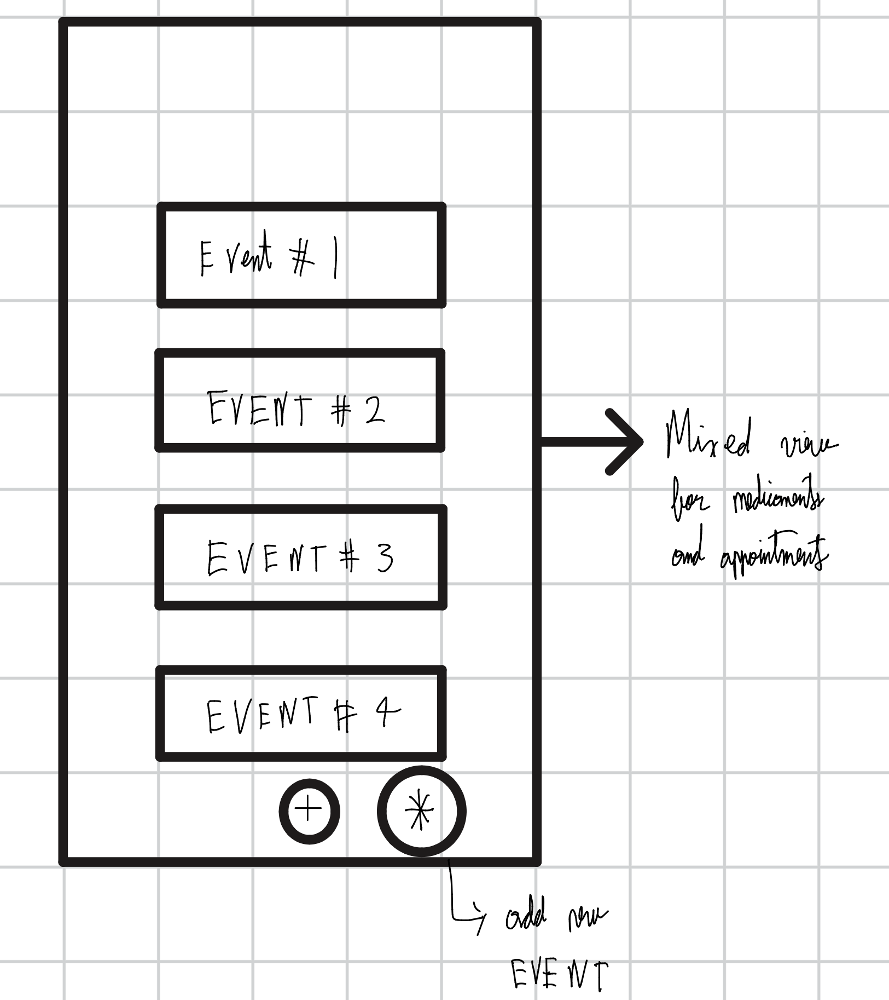
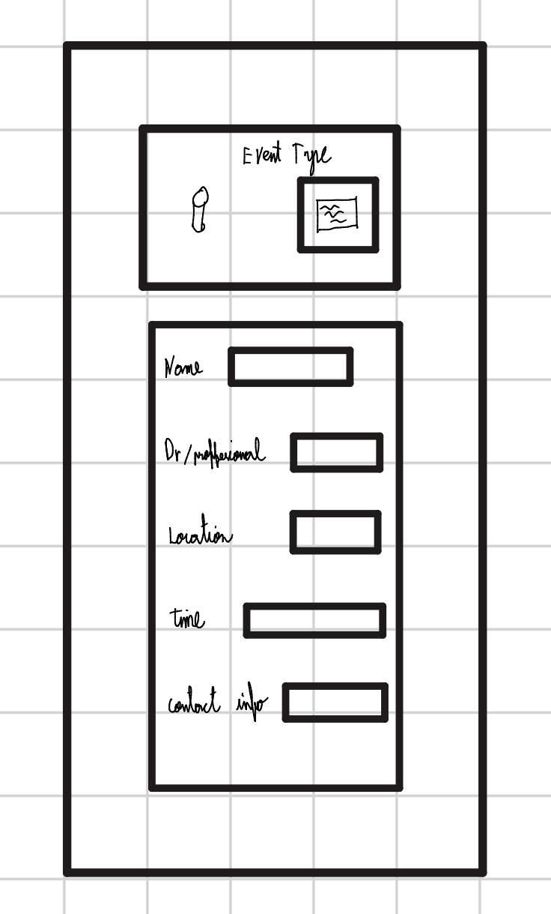

# Health Companion Super App
## UX/UI Case Study

**Author:** Sergio Abreo Alvarez
**Date:** February 2025

---

## Project Overview

A mobile app designed to help individuals with managing their intake of medicaments or to set reminders for their medical appointments. The app is also meant to help users find all related information to their medicaments and medical appointments in one place through their respective events

### Problem Statement

People with chronic conditions often juggle medications, appointments, and doctor communication while trying to live their everyday lives. Forgetfulness, disorganization, and poor coordination can negatively affect their health outcomes.

Our challenge is to design an intuitive mobile app that simplifies health management, improves adherence, and helps users feel in control of their care.

### Goals

- Help users manage medication schedules effectively
- Simplify doctor appointment booking and reminders
- Enable communication with healthcare providers
- Track health progress over time

---

## 1. User Research

### Research Methods

For this project and article, I conducted a series of interviews with persons that are in the age range of 30 to 60 years old in order to get a wider view on what an application of this nature should be.

For privacy reasons, and because the people that interviewed asked to remain anonymous, I will discuss their opinions and needs as a group and refer to them as "They" on this section of the article.

#### Interviews
The way that the interviews were handled, I the "researcher" for this project and product asked a set of simple questions when it comes to the user interface of the application and the User interactions.

My main questions were the following:

1. How should reminders be set, per event, depending on the nature of the event, or should it be a global setting for all events?
2. How should the events be created? 
3. How many details should the user be required to fill in?
4. What details should be required for each event type?
5. Should the app have extensive setting customization? or should it use the accessibility settings taken from the device?
6. What accessibility accommodations would they like to see in the application?

Across the board participants had a consistent set of answers for each question. 

The needs and wants that I could take away from my interview are the following:

1. Reminders should all have the same behavior and should be set globally and only once.
2. Events should be created through the main page, which would then take the user to another page that is dedicated to the event creation.
3. The user should have a visual selector for the medication or appointment selection field, depending on which event type the user selects the following input fields will be displayed accordingly.
4. The required details are only the essential related to each kind of event.
5. The app should require very little to no setup.
6. The users want the input fields to be easy to understand and to fill up.

#### Secondary Research
In order to get a better picture of the utility and need for an application of this nature I also took the liberty to look up existing studies related to what are the impacts of health companion applications for individuals that need to take medications on the regular.

From what I found based on the following articles:

1. Iribarren S, Akande T, Kamp K, Barry D, Kader Y, Suelzer E
Effectiveness of Mobile Apps to Promote Health and Manage Disease: Systematic Review and Meta-analysis of Randomized Controlled Trials
JMIR Mhealth Uhealth 2021;9(1):e21563
URL: https://mhealth.jmir.org/2021/1/e21563
DOI: 10.2196/21563

2. Yihang Peng, MN, Han Wang, MM, Qin Fang, BS 949560838@qq.com, Liling Xie, BS, Lingzhi Shu, MN, Wenjing Sun, MN, and Qin Liu,
Effectiveness of Mobile Applications on Medication Adherence in Adults with Chronic Diseases: A Systematic Review and Meta-Analysis
Journal of Managed Care & Specialty Pharmacy Volume 26, Number 4
URL: https://www.jmcp.org/doi/10.18553/jmcp.2020.26.4.550
DOI: 10.18553/jmcp.2020.26.4.550

Both of those articles explore the benefits of having a companion app to set reminders for medication. While they both express in their own way the need for further research, they did conclude that there is credible evidence that the use of a companion app such as the one for this mini-project has a meaningful impact on a user's ability to adhere to their medication in the long term.

Through the research that I conducted regarding existing articles on this matter I did come across a few more that for the needs of this article would not necessarily add more relevant information that the above mentioned ones. However I did see a recurring theme where they asked the same question multiple times. What are the features of a companion app that make it so users take their medication regularly at the right time? They would also ask a follow up question along the lines of, what new features could be added to the optimal health companion app?

### Key Research Findings

Following the interviews and secondary research, I have the following key findings that dictate the design of the application:

| Finding | Insight | Design Implication |
|---------|---------|-------------------|
| Global setting for reminders | This is done once at the first use and never changes unless the user wants to | Event creation page has one less field, main feature of the app is automated |
| Dedicated page for event creation | Users want a robust mechanism to add event details| Extra page for the application |
| Key UI elements should be images | UI should be simplified to accommodate users with lower cognitive capabilities | Make use of skeuomorphism |
| No dedicated page for event type | Users want to have all relevant information on the same page | No need for dedicated pages for each event type |

---

## 2. User Personas

PLACE HOLDER TO TEST LAYOUT OF THE PAGE

### Persona 1: Maria Santos

| Attribute | Details |
|-----------|---------|
| **Age** | 54 |
| **Occupation** | Elementary School Teacher |
| **Health Condition** | Type 2 Diabetes and Hypertension |
| **Tech Comfort** | Low to Moderate: uses her phone mainly for calls, messaging, and basic apps |

**Goals:**
- Keep track of her daily medications (metformin, blood pressure pills) without having to memorize times or doses
- Have a single place to see upcoming doctor appointments so she never misses a check-up
- Spend as little time as possible setting up the app so she can focus on her day

**Motivations:**
- After missing a dose of her blood pressure medication and experiencing dizziness at work, Maria wants a reliable system that keeps her on track
- She values simplicity, she does not want to learn a complicated app; she wants something that "just works" after a quick setup

**Pain Points:**
- She currently relies on handwritten notes and memory to manage her medications, which leads to missed doses especially during busy school days
- Coordinating appointments across multiple specialists (endocrinologist, cardiologist, family doctor) is confusing and she has double-booked in the past
- Apps she has tried before required too much setup and had cluttered interfaces that overwhelmed her

**Quote:** *"I just want something simple that reminds me to take my pills and tells me when my next appointment is, I don't need all the bells and whistles."*

---

### Persona 2: David Chen

| Attribute | Details |
|-----------|---------|
| **Age** | 37 |
| **Occupation** | Software Project Manager |
| **Health Condition** | Asthma and Generalized Anxiety Disorder |
| **Tech Comfort** | High: comfortable with technology and uses multiple productivity apps daily |

**Goals:**
- Manage his daily anxiety medication and as-needed inhaler usage from one centralized app
- Quickly create and review health-related events without navigating through multiple screens
- Have visual, intuitive input fields that make event creation fast and error-free

**Motivations:**
- David's busy work schedule means he often forgets to take his anxiety medication at the same time each day, leading to inconsistent symptom management
- He wants to consolidate his health management into one app instead of juggling calendar reminders, pharmacy apps, and sticky notes

**Pain Points:**
- His current approach of using generic calendar reminders does not distinguish between medication events and appointment events, making it hard to see his health schedule at a glance
- He finds it frustrating when apps require him to configure reminder settings for every single event rather than setting a global preference once
- He wants to see all relevant details for an event on one page without being redirected to separate screens for different event types

**Quote:** *"I already manage a dozen tools for work, I need my health app to be the one thing I don't have to think about configuring."*

---

## 3. User Journey Map

### Journey Stages

#### Stage 1: Awareness
- **Actions:** [What user does]
- **Thoughts:** [What user thinks]
- **Emotions:** [How user feels]
- **Pain Points:** [Challenges]
- **Opportunities:** [Design opportunities]

#### Stage 2: Onboarding
- **Actions:** [What user does]
- **Thoughts:** [What user thinks]
- **Emotions:** [How user feels]
- **Pain Points:** [Challenges]
- **Opportunities:** [Design opportunities]

#### Stage 3: Daily Use
- **Actions:** [What user does]
- **Thoughts:** [What user thinks]
- **Emotions:** [How user feels]
- **Pain Points:** [Challenges]
- **Opportunities:** [Design opportunities]

#### Stage 4: Appointment Booking
- **Actions:** [What user does]
- **Thoughts:** [What user thinks]
- **Emotions:** [How user feels]
- **Pain Points:** [Challenges]
- **Opportunities:** [Design opportunities]

---

## 4. Wireframes

### Low-Fidelity Wireframes

#### Home Screen

PLACE HOLDER TO TEST LAYOUT OF THE PAGE

*Description: [Explain the key elements and their purpose]*

---

#### Medication Reminder Screen

PLACE HOLDER TO TEST LAYOUT OF THE PAGE

*Description: [Explain the key elements and their purpose]*

---

#### Appointment Scheduling Screen

PLACE HOLDER TO TEST LAYOUT OF THE PAGE

*Description: [Explain the key elements and their purpose]*

---

#### Additional Screens

PLACE HOLDER TO TEST LAYOUT OF THE PAGE

### Design Iterations

#### Iteration 1

PLACE HOLDER TO TEST LAYOUT OF THE PAGE

*What changed and why:* [Explain the evolution]

#### Iteration 2

PLACE HOLDER TO TEST LAYOUT OF THE PAGE

*What changed and why:* [Explain the evolution]

---

## 5. Prototype

### Interactive Prototype

PLACE HOLDER TO TEST LAYOUT OF THE PAGE

[Embed or link to Figma/Adobe XD prototype]

**Figma Prototype Link:** 

<!-- You can embed Figma prototypes like this: -->
<!-- <iframe style="border: 1px solid rgba(0, 0, 0, 0.1);" width="800" height="450" src="https://www.figma.com/embed?embed_host=share&url=YOUR_FIGMA_URL" allowfullscreen></iframe> -->

### Key Screens (Final Mockups)

PLACE HOLDER TO TEST LAYOUT OF THE PAGE

### User Flow

PLACE HOLDER TO TEST LAYOUT OF THE PAGE

[ the main user flow demonstrated in the prototype]

1. User opens app → Home screen
2. User taps medication reminder → Medication list
3. User schedules appointment → Calendar view
4. [Continue flow...]

---

## 6. Usability Testing

### Testing Plan

**Goals:**
- [Test goal 1]
- [Test goal 2]

**Participants:** [Number and characteristics of test users]

**Tasks:**
1. [Task 1 - e.g., "Set a medication reminder for 8 AM daily"]
2. [Task 2 - e.g., "Schedule a doctor appointment for next week"]
3. [Task 3 - e.g., "Find your medication history"]

**Metrics:**
- Task completion rate
- Time on task
- Error rate
- User satisfaction (SUS score)

### Feedback Collection Method

[Describe how you collected feedback - think-aloud protocol, post-task questionnaires, etc.]

### Key Findings & Iterations

| Issue Found | Severity | Solution Implemented |
|-------------|----------|---------------------|
| [Issue 1] | High/Medium/Low | [How you fixed it] |
| [Issue 2] | High/Medium/Low | [How you fixed it] |
| [Issue 3] | High/Medium/Low | [How you fixed it] |

### User Feedback Summary

PLACE HOLDER TO TEST LAYOUT OF THE PAGE

> *"[Direct quote from user testing]"* - Participant 1

> *"[Direct quote from user testing]"* - Participant 2

---

## 7. Reflection

### What I Learned

[Reflect on how the UX design process helped me identify user needs and improve the product]

### Challenges Encountered

1. **[Challenge 1]:** [How i overcame it]
2. **[Challenge 2]:** [How i overcame it]
3. **[Challenge 3]:** [How i overcame it]

### What I Would Do Differently

PLACE HOLDER TO TEST LAYOUT OF THE PAGE

[Insights for future projects]

### Conclusion

PLACE HOLDER TO TEST LAYOUT OF THE PAGE

[Final thoughts on the project and the UX/UI design process]

---

## Appendix

### Research Materials

PLACE HOLDER TO TEST LAYOUT OF THE PAGE

- [Article 1](https://www.jmcp.org/doi/10.18553/jmcp.2020.26.4.550)
- [Article 2](https://mhealth.jmir.org/2021/1/e21563)

### All Wireframe Iterations

PLACE HOLDER TO TEST LAYOUT OF THE PAGE

[Additional images if needed]

### Full Usability Test Results

PLACE HOLDER TO TEST LAYOUT OF THE PAGE

[Detailed data if applicable]

---

*This case study was created as part of SOEN 357 at Concordia University.*
