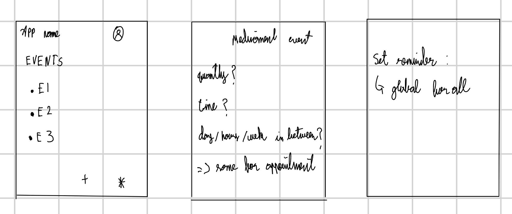
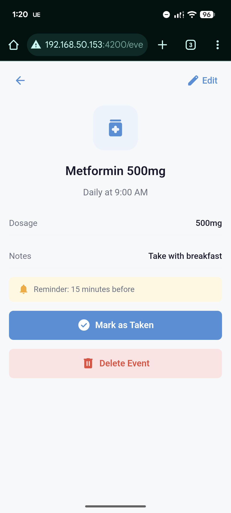
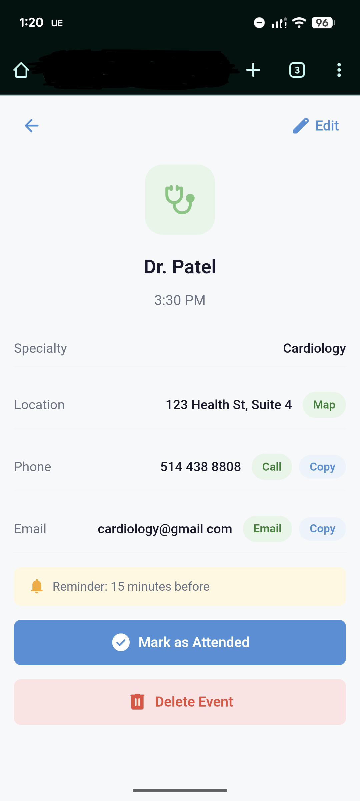
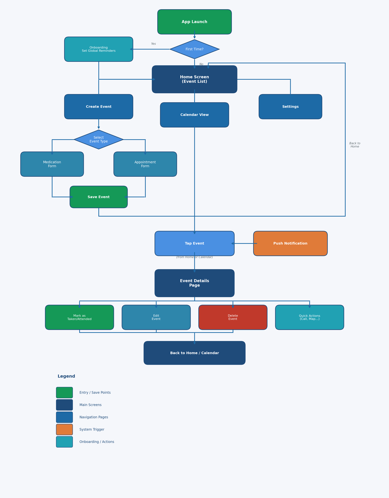

# Health Companion Super App
## UX/UI Case Study

**Author:** Sergio Abreo Alvarez, ID: 40274677
**Date:** February 2025
**Page URL:** https://pergioa.github.io/

---

### Table of Contents

1. [Project Overview](#project-overview)
2. [User Research](#1-user-research)
3. [User Personas](#2-user-personas)
4. [User Journey Map](#3-user-journey-map)
5. [Storyboard](#4-storyboard)
6. [Wireframes](#5-wireframes)
7. [Prototype](#6-prototype)
8. [Usability Testing](#7-usability-testing)
9. [Reflection](#8-reflection)
10. [Appendix](#appendix)

## Project Overview

A mobile app designed to help individuals manage their intake of medications or to set reminders for their medical appointments. The app is also meant to help users find all related information about their medications and medical appointments in one place through their respective events.

### Problem Statement

People with chronic conditions often juggle medications, appointments, and doctor communication while trying to live their everyday lives. Forgetfulness, disorganization, and poor coordination can negatively affect their health outcomes.

Our challenge is to design an intuitive mobile app that simplifies health management, improves adherence, and helps users feel in control of their care.

### Goals

- Help users manage medication schedules effectively
- Simplify doctor appointment booking and reminders
- Enable communication with healthcare providers
- Track health progress over time

## 1. User Research

### Research Methods

For this project and article, I conducted a series of interviews with individuals in the age range of 30 to 60 years old to get a broader perspective on what an application of this nature should be.

For privacy reasons, and because the people who were interviewed asked to remain anonymous, I will discuss their opinions and needs as a group and refer to them as "They" in this section of the article.

#### Interviews
For the interviews, I asked a set of simple questions related to the user interface of the application and the user interactions.

My main questions were the following:

1. How should reminders be set, per event, depending on the nature of the event, or should it be a global setting for all events?
2. How should the events be created? 
3. How many details should the user be required to fill in?
4. What details should be required for each event type?
5. Should the app have extensive setting customization? Or should it use the accessibility settings taken from the device?
6. What accessibility accommodations would they like to see in the application?

Across the board, participants had a consistent set of answers for each question.

The needs and wants that I could take away from my interviews are the following:

1. Reminders should all have the same behavior and should be set globally and only once.
2. Events should be created through the main page, which would then take the user to another page that is dedicated to the event creation.
3. The user should have a visual selector for the medication or appointment selection field. Depending on which event type the user selects, the following input fields will be displayed accordingly.
4. The required details are only the essentials related to each kind of event.
5. The app should require very little to no setup.
6. The users want the input fields to be easy to understand and to fill out.

#### Secondary Research
To get a better picture of the utility and need for an application of this nature, I also took the liberty of looking up existing studies related to the impact of health companion applications for individuals who need to take medications on a regular basis.

Based on the following articles:

1. Iribarren S, Akande T, Kamp K, Barry D, Kader Y, Suelzer E
Effectiveness of Mobile Apps to Promote Health and Manage Disease: Systematic Review and Meta-analysis of Randomized Controlled Trials
JMIR Mhealth Uhealth 2021;9(1):e21563
URL: https://mhealth.jmir.org/2021/1/e21563
DOI: 10.2196/21563

2. Yihang Peng, MN, Han Wang, MM, Qin Fang, BS 949560838@qq.com, Liling Xie, BS, Lingzhi Shu, MN, Wenjing Sun, MN, and Qin Liu,
Effectiveness of Mobile Applications on Medication Adherence in Adults with Chronic Diseases: A Systematic Review and Meta-Analysis
Journal of Managed Care & Specialty Pharmacy Volume 26, Number 4
URL: https://www.jmcp.org/doi/10.18553/jmcp.2020.26.4.550
DOI: 10.18553/jmcp.2020.26.4.550

Both of those articles explore the benefits of having a companion app to set reminders for medication. While they both express in their own way the need for further research, they did conclude that there is credible evidence that the use of a companion app such as the one for this mini-project has a meaningful impact on a user's ability to adhere to their medication schedule in the long term.

Through my research, I did come across a few more articles that would not necessarily add more relevant information than the ones mentioned above. However, I did see a recurring theme where they asked the same question multiple times: what are the features of a companion app that make users take their medication regularly at the right time? They would also ask a follow-up question along the lines of: what new features could be added to the optimal health companion app?

### Key Research Findings

Following the interviews and secondary research, I have the following key findings that dictate the design of the application:

| Finding | Insight | Design Implication |
|---------|---------|-------------------|
| Global setting for reminders | This is done once at the first use and never changes unless the user wants to | Event creation page has one less field, main feature of the app is automated |
| Dedicated page for event creation | Users want a robust mechanism to add event details| Extra page for the application |
| Key UI elements should be images | UI should be simplified to accommodate users with lower cognitive capabilities | Make use of skeuomorphism |
| No dedicated page for event type | Users want to have all relevant information on the same page | No need for dedicated pages for each event type |

## 2. User Personas

### Persona 1: Maria Santos

| Attribute | Details |
|-----------|---------|
| **Age** | 54 |
| **Occupation** | Elementary School Teacher |
| **Health Condition** | Type 2 Diabetes and Hypertension |
| **Tech Comfort** | Low to Moderate: uses her phone mainly for calls, messaging, and basic apps |

**Goals:**
- Keep track of her daily medications (metformin, blood pressure pills) without having to memorize times or doses
- Have a single place to see upcoming doctor appointments so she never misses a check-up
- Spend as little time as possible setting up the app so she can focus on her day

**Motivations:**
- After missing a dose of her blood pressure medication and experiencing dizziness at work, Maria wants a reliable system that keeps her on track
- She values simplicity. She does not want to learn a complicated app; she wants something that "just works" after a quick setup

**Pain Points:**
- She currently relies on handwritten notes and memory to manage her medications, which leads to missed doses especially during busy school days
- Coordinating appointments across multiple specialists (endocrinologist, cardiologist, family doctor) is confusing, and she has double-booked in the past
- Apps she has tried before required too much setup and had cluttered interfaces that overwhelmed her

**Quote:** *"I just want something simple that reminds me to take my pills and tells me when my next appointment is. I don't need all the bells and whistles."*

### Persona 2: David Chen

| Attribute | Details |
|-----------|---------|
| **Age** | 37 |
| **Occupation** | Software Project Manager |
| **Health Condition** | Asthma and Generalized Anxiety Disorder |
| **Tech Comfort** | High: comfortable with technology and uses multiple productivity apps daily |

**Goals:**
- Have a single app to manage both his asthma medication and anxiety-related prescriptions without adding yet another tool to his workflow
- Receive reminders that cut through the noise of his many daily notifications
- Keep track of appointments across his general practitioner and therapist without redundant data entry

**Motivations:**
- David already uses several productivity apps to manage his work and personal life, but none of them handle health events well, and he does not want to scatter his medical information across multiple platforms
- After forgetting to refill his inhaler prescription and having an asthma flare-up during a stressful sprint, he wants a dedicated system that handles health reminders reliably

**Pain Points:**
- He receives dozens of notifications daily from work tools, and health reminders from generic apps often get buried or dismissed alongside less important alerts
- Existing health apps he has tried require too much manual input and do not integrate smoothly into his fast-paced routine
- Juggling multiple productivity tools already feels overwhelming, and adding a complicated health app would only increase his anxiety

**Quote:** *"I do not need another app that takes 20 minutes to set up. I need something that works right away and does not get lost in my notification noise."*

### Persona 3: Chris Redfield

| Attribute | Details |
|-----------|---------|
| **Age** | 70 |
| **Occupation** | Retired |
| **Health Condition** | Depression |
| **Tech Comfort** | Low: has a basic understanding of how to use a phone |

**Goals:**
- Manage his daily depression medication
- Keep up with his treatment to get better
- Have an easy-to-understand application

**Motivations:**
- Since his wife died a few months back, Chris has been dealing with depression and struggled to take his medications on a regular basis
- He wants to have a reminder that is hard to miss for his medications and routine appointments with the psychologist

**Pain Points:**
- Due to his depression, he has very little motivation to do anything, which makes it easy for him to not take his depression medication
- He finds technology hard to use and understand without the help of a younger individual. An intuitive design would allow him to use the application independently
- He wants to have systematic reminders for all important events related to his medication and appointments in order to overcome his depression

**Quote:** *"Since my wife died, I have struggled with depression. It has been difficult for me to keep up with my medication since most days I don't feel like doing anything and want to stay in bed."*

## 3. User Journey Map

## 4. Storyboard

The following storyboard walks through how Maria Santos, one of our primary personas, would discover and use the Health Companion App in her daily life. Due to a severe lack of artistic capabilities, I opted for writing out the various scenes of my storyboard instead of attempting to illustrate them and failing miserably.

---

### Scene 1: Discovery & Download

| | |
|---|---|
| **User** | Maria Santos (54, manages diabetes & hypertension) |
| **Context** | Maria struggles to remember her multiple daily medications and upcoming doctor appointments |
| **Action** | She discovers the Health Companion App through a recommendation and downloads it |
| **Emotion** | Hopeful but cautious, she has been let down by complicated apps before |

---

### Scene 2: Onboarding

| | |
|---|---|
| **Trigger** | Maria opens the app for the first time |
| **Action** | The app greets her with a simple onboarding screen and guides her to set global reminder preferences (notification timing, sound) |
| **Design Decision** | Minimal setup required, no overwhelming forms or account creation walls |
| **Emotion** | Relieved that setup is quick and painless |

---

### Scene 3: Creating a Medication Event

| | |
|---|---|
| **Trigger** | Maria taps the "Create Event" button on the home screen |
| **Action** | She selects "Medication" as the event type. A dynamic form appears with fields for medication name, dosage, frequency, time, and reminder settings. She saves the event and returns to the home screen where it now appears in her list |
| **Design Decision** | Progressive disclosure, the form only shows fields relevant to the selected event type |
| **Emotion** | Confident, the visual selectors and clear labels make the process intuitive |

---

### Scene 4: Creating an Appointment Event

| | |
|---|---|
| **Trigger** | Maria has a doctor visit coming up and taps "Create Event" again |
| **Action** | She selects "Appointment" as the event type and fills in the doctor name, location, date/time, and reminder preferences. The appointment is saved and visible on both the home screen and calendar view |
| **Design Decision** | Both event types are created from the same page, no separate navigation needed |
| **Emotion** | Organized, all her health events are now in one place |

---

### Scene 5: Daily Use, Medication Reminder

| | |
|---|---|
| **Trigger** | At the scheduled time, Maria receives a push notification |
| **Action** | She taps the notification and is taken directly to the medication details page. She reviews the dosage info and taps "Mark as Taken". The event visually moves to the "Completed" group on the home screen |
| **Design Decision** | Large, high-contrast completion button centered on screen, impossible to miss |
| **Emotion** | Accomplished, a quick tap and she can move on with her day |

---

### Scene 6: Appointment Reminder

| | |
|---|---|
| **Trigger** | The day before her appointment, Maria gets a reminder notification |
| **Action** | She taps it and sees the appointment details page with quick action buttons (directions, reschedule). After attending, she marks it as "Attended" |
| **Design Decision** | Quick action buttons reduce the steps needed to prepare for the appointment |
| **Emotion** | Prepared and in control of her healthcare schedule |

---

### Scene 7: Calendar View

| | |
|---|---|
| **Trigger** | Maria taps the calendar icon in the navigation bar |
| **Action** | She sees her events organized by date. Completed events are visually differentiated (greyed out with checkmarks). She can tap any date to see that day's medications and appointments, and edit or delete events from this view |
| **Design Decision** | Visual distinction between pending and completed events reduces cognitive load |
| **Emotion** | Reassured, she can see her full health schedule at a glance |

---

### Scene 8: Settings & Customization

| | |
|---|---|
| **Trigger** | Maria visits Settings from the navigation bar |
| **Action** | She adjusts notification preferences and tweaks reminder timing and display options to match her routine |
| **Design Decision** | Settings are kept minimal, only the options that matter for the core experience |
| **Emotion** | Comfortable, the app adapts to her needs without requiring technical knowledge |

## 5. Wireframes & Sketches

### Sketckes

At first I had a very rough idea of how the app should display information or ask for details. The following image shows the only sketches made before opting for wireframes once the concept of the design became clearer to myself.

### Low-Fidelity Wireframes

These are the initial wireframes for each page, if changes were done to a page I did not make a new wireframe for it. After having a first prototype, that was the only artifact that got updates.

  

    
    
Home Screen

  

  

    
    
Appointment Scheduling

  

  

    
    
Medication Scheduling

  

  

    
    
Calendar View

  

The home screen displays all events for the day and provides access to settings and event creation. The appointment and medication scheduling screens share the same layout, with fields tailored to each event type. The calendar view was added later based on user feedback to allow viewing events by date.

During the prototyping phase, several changes were made to these wireframes. The event creation button was moved above the navigation bar and made larger with meaningful text to accommodate users with lower familiarity with technology. Input fields on the scheduling screens were simplified for elderly users, and the save button was enlarged with distinct styling to indicate when it can be used. Additional pages were added based on user feedback, but no wireframes were created for those since a prototype with a well-defined UI design was already in place.

## 6. Prototype

### Interactive Prototype

Not all iterations will be shown on this article due to the amount of images that it would required, Instead I will only include the set of the lasts Iterations of the prototype that had small changes towards the end.

#### Home Page

  

    
    
Iteration 1

  

  

    
    
Iteration 2

  

*In the first iteration, there was no visual difference between completed and pending events. The second iteration groups events into two sections with distinct styling to set them apart.*

#### Calendar View

  

    
    
Iteration 1

  

  

    
    
Iteration 2

  

*Same issue as the home page. The second iteration adds the completed and not completed grouping with differentiated styling.*

#### Remaining Screens

  

    
    
Create Medication

  

  

    
    
Create Appointment

  

  

    
    
Medication Details

  

  

    
    
Appointment Details

  

  

    
    
Settings

  

  

    
    
First Usage

  

*The medication and appointment creation pages saw small key changes over the course of this case study. Animations were added for the dynamic elements and the create button had its styling updated. The appointment details page had Copy, Call, Map, and Email buttons added to allow the user to quickly perform each action. The medication details, settings, and first usage pages saw no major changes.*

**Angular prototype** 

The prototype allows the reader to experience how the app would behave and walk through the main flows explained in the next section. The web app is mainly built for mobile devices, so it is advised that the reader consult the README.md to try it out on a mobile device and see the pages displayed in the same way as the pictures above.

- [Repo to interactive prototype](https://github.com/pergioa/UI-MockUp-SOEN357)

### User Flow

The prototype demonstrates two primary user flows that represent the core functionality of the application: creating an event and responding to a reminder. Then, there are flows related to event completion, editing event details, deleting events, and performing quick actions related to an event such as calling, sending email, or using the map for directions. 

## 7. Usability Testing

### Testing Plan

**Goals:**
- Evaluate whether users can complete core tasks (creating medication events, scheduling appointments, and confirming reminders) without assistance
- Assess if the onboarding flow and global reminder setup are intuitive enough for users with low tech comfort
- Identify pain points in the event creation process, particularly around the visual selectors and conditional input fields

**Participants:** Five participants were recruited for the usability test. The group was composed of individuals who match the demographics and tech comfort levels represented by the three personas: two participants in the 50-60 age range with low to moderate tech comfort, one participant in the 30-40 age range with high tech comfort, and two participants aged 65 and older with low tech comfort. None of the participants had prior experience with the prototype.

**Tasks:**
1. Complete the onboarding process and set a global reminder preference
2. Create a new medication event for a daily blood pressure pill at 8:00 AM
3. Create a new appointment event with a cardiologist for next Tuesday at 10:00 AM
4. Open the app after receiving a reminder notification and confirm the medication as taken
5. View all upcoming events on the main screen and identify the next scheduled appointment

**Metrics:**
- Task completion rate
- Time on task
- Error rate
- User satisfaction

### Feedback Collection Method

Feedback was collected as the users used the app. Before the user started going over the actions, I asked them to verbalize all their thoughts as they used the app. Each session lasted about 20 minutes. After completing all tasks, participants filled out a short post-task questionnaire where they rated the app on a few characteristics on a scale from 1 to 5, with 1 being not satisfied and 5 being very satisfied and a neutral grading for 3. The questions were the following:

1. How would you rate your overall experience?
2. What did you find the most intuitive and how would you grade its implementation?
3. What did you find the most confusing and how would you grade its implementation?

During each session, I noted down all the comments that users made that helped me realize the UI could be reworked to streamline the flows I was evaluating in terms of user experience.

### Key Findings & Iterations

The following table shows the key issues that I found during the user test runs. I've included the severity in terms of low, medium, or high to describe how much it impacted the overall user experience and what solution I came up with for each problem.

| Issue Found | Severity | Solution Implemented |
|-------------|----------|---------------------|
| Older participants did not immediately recognize the event type selector as tappable | High | Increased the size of the visual selector icons and added a subtle border highlight to indicate interactivity |
| One participant was confused by the conditional fields that appear after selecting an event type | Medium | Added a short animation to allow the users to see the dynamic components change in real time depending on the event that is selected |
| Participants with low tech comfort took significantly longer on the appointment creation task | Low | Simplified the required information needed to create the event |
| The confirmation action after a reminder notification was not prominent enough | High | Enlarged the "Mark as Taken" button and changed its color to a high-contrast blue so it stands out immediately upon opening the app |
| There was no way to see events for following days | Medium | Implemented a calendar view to see events on any given day |

## 8. Reflection

### What I Learned

This project reinforced how important it is to design an application with the target demographic in mind in order to truly meet their needs when it comes to the features implemented in the application. For instance, in the case of users who would be aligned with my personas such as Maria and Chris, the UI has to be simple to understand and streamline all the interactions by giving them solid visual helpers such as icons that represent real-life objects so they can understand what they are doing or what to tap based on what they need.

The usability testing was also a very eye-opening first experience because it further reinforced that I need to ask the real users what they want and need. Even though I thought my research had produced solid personas, there were a few things that I had missed. For instance, what I would deem as obvious might be puzzling for people who know less about technology. Having real users test-drive the app helped me fine-tune the experience more towards the user than to my assumptions.

I also learned more about the pitfalls of these kinds of applications and what helps them be successful by reading research articles on this subject.

### Challenges Encountered

1. **Designing for a wide range of tech comfort levels:** The personas ranged from David, who is highly comfortable with technology, to Chris, who can barely navigate a phone. Balancing the needs of both without making the app feel too basic for one group or too complex for the other was difficult. I managed to strike a balance by following a "Less is more" approach. The UI is minimal and straight to the point; each button has a clear action without compromising functionality. This means an experienced user can appreciate the simplicity of the app being quick and responsive, while a user who is less comfortable with a phone is able to use the app without having to ask for help from another person.

2. **Keeping the event creation flow on a single page:** The research findings indicated that users did not want separate pages for different event types, but fitting medication and appointment fields on the same page without clutter was a challenge. I addressed this by using dynamic forms with fields that would appear or disappear based on the user inputs.

3. **Making reminders hard to miss without being intrusive:** Chris's persona highlighted that on low-motivation days, a notification can easily be dismissed and forgotten. At the same time, overly aggressive reminders could frustrate users like David who are already managing many notifications. I resolved this by making the completion button the centerpiece of the page. When the user taps on an event, their gaze will see the completion button first since it is centered on the screen.

### What I Would Do Differently

If I were to start this project over, I would recruit a larger and more diverse group of participants for both the initial interviews and the usability testing. Five participants provided valuable insights, but a larger sample would have increased confidence in the findings and potentially revealed edge cases that were missed. If I had more time and fewer courses and projects to keep up with, I would have conducted more usability test runs to make sure I ironed out my revisions and fine-tuned the experience as much as possible to cater to my target audience.

Additionally, I would explore accessibility features more thoroughly from the start. While the current design accounts for low tech comfort through visual simplicity and large interactive elements, I did not deeply investigate accommodations for users with visual impairments, motor difficulties, or other accessibility needs beyond cognitive load. Integrating accessibility testing tools and consulting established guidelines such as WCAG earlier in the process would have resulted in a more inclusive design.

### Conclusion

The Health Companion Super App case study demonstrates that a user-centered design process, grounded in real interviews, persona development, and iterative usability testing, leads to a product that addresses the needs of its target audience rather than the developer's assumptions. By prioritizing simplicity, minimizing setup, and using visual cues to guide interaction, the app is positioned to help individuals with chronic conditions stay on top of their medications and appointments without adding complexity to their daily lives.

The research confirmed that health companion apps have a meaningful impact on medication adherence, and the design decisions made throughout this project were directly informed by what users expressed they needed. While there is room for further refinement, particularly around accessibility and more extensive usability testing, the foundation built through this UX/UI process provides a strong starting point for a product that could make a real difference in people's health outcomes.

## Appendix

### Research Materials

- [Effectiveness of Mobile Applications on Medication Adherence in Adults with Chronic Diseases: A Systematic Review and Meta-Analysis](https://www.jmcp.org/doi/10.18553/jmcp.2020.26.4.550)
- [Effectiveness of Mobile Apps to Promote Health and Manage Disease: Systematic Review and Meta-analysis of Randomized Controlled Trials](https://mhealth.jmir.org/2021/1/e21563)

*This case study was created as part of SOEN 357 at Concordia University.*
